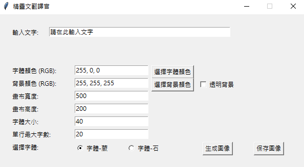

# 精靈文翻譯官

## 發想

發想來源於: https://github.com/justfont/Elffont

由於自己很喜歡這個字體，但苦於不太喜歡打注音，  
如果有長篇的文章也沒辦法將整段文字直接轉成精靈文，  
因此自己做了一款小程式將繁體轉注音，以及字體調色等基本功能打包。  

## UI介紹

具體的UI設計如下 :

功能包含了文字、背景顏色，字體大小、畫布大小、換行字數等等基本調整，  
輸入文字區域可以貼上整段你想轉成精靈文體的文章，  
程式會自動刪去標點符號以保持整個文字段落的連貫性。
其下可以選擇岩或者蕨字體作為輸出。

按下**生成圖像**按鍵後，會出現另一個視窗展示目前的生成圖像。
按下**保存圖像**按鍵後，可以選擇儲存資料夾，圖片名稱為**output_image.png**。

## 資料夾內容

包含了一個.ipynb檔案
以及另一個我將字體一起打包的.exe檔案

## 已知問題

- 程式中將繁體轉換為注音使用的是 pypinyin 套件，在遇到具備多個讀音的繁體字時(例如 : 行)，在精靈文轉譯
  時可能採用非原文語意的讀音

## 程式碼使用建議

- 在 PIL 版本更新後，ImageDraw 對象中的 textsize 方法被替換為 textlength 和 textbbox，請在使用時確保PIL版本不會過舊

